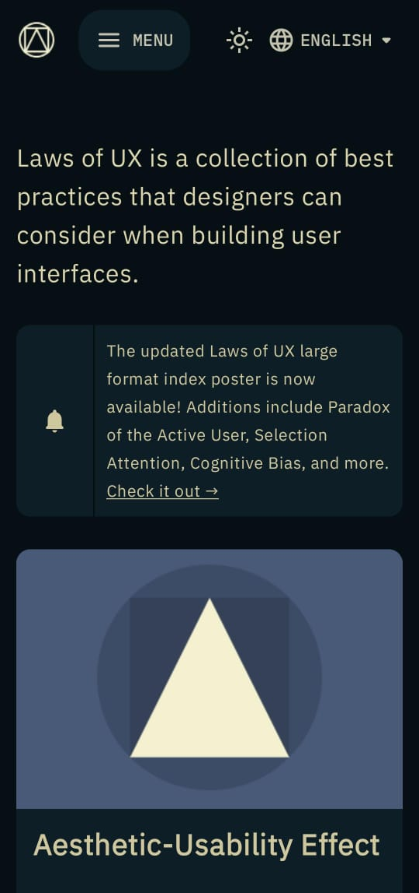
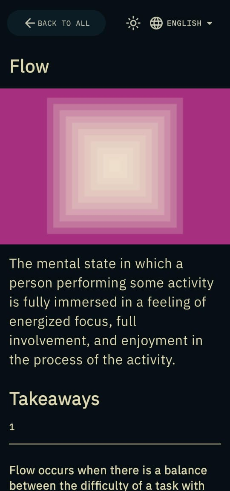
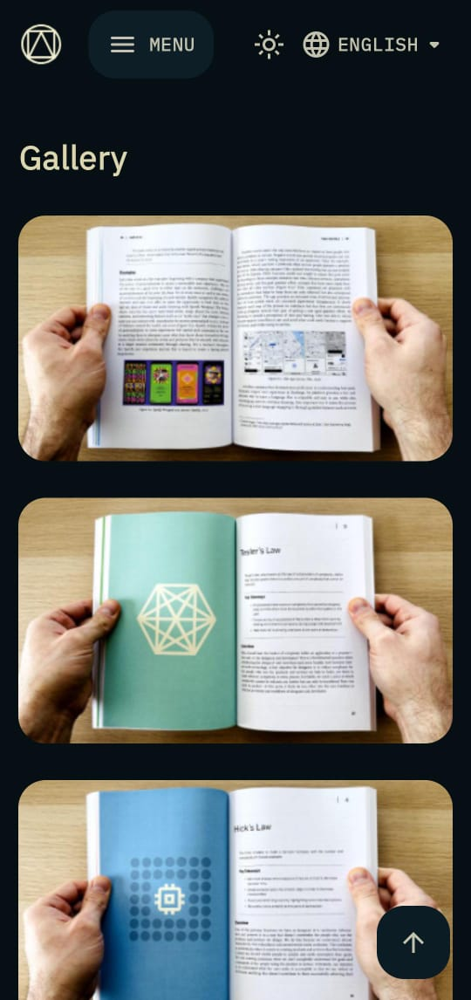
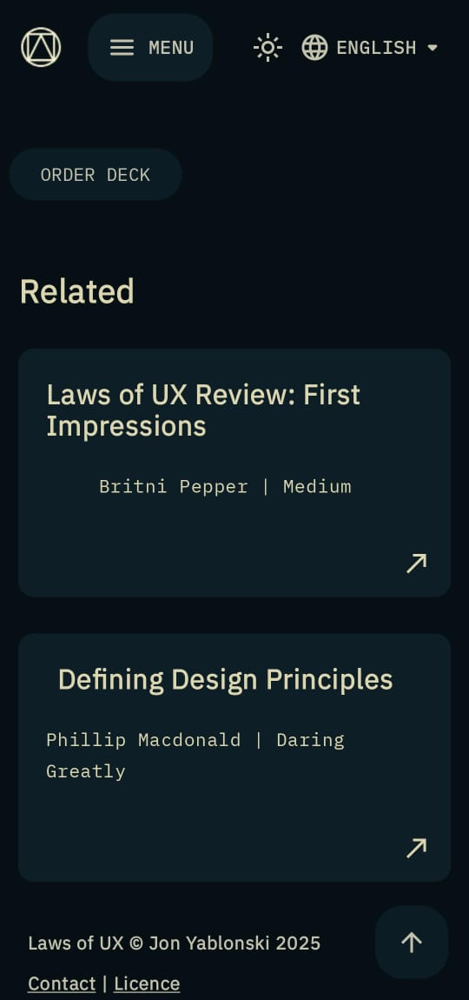
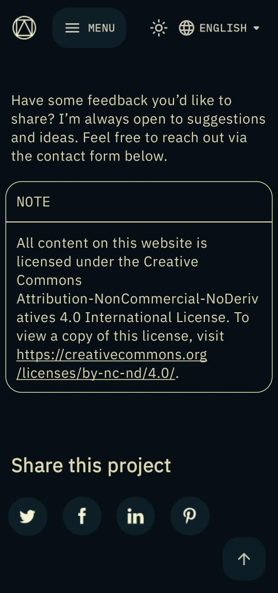

# Laws Of UX

## Overview

- This project is a mock Android app that was inspired by the [Laws of UX](https://lawsofux.com/) website...

## Table of Contents

1. [Background](#Background)
2. [Architecture](#Architecture)
3. [Tests](#Tests)
4. [Screenshots](#Screenshots)
5. [Tools and Libraries](#Tools-and-Libraries)
6. [Trivia](#Trivia)
7. [Future](#Future)

## Background

- Owing to the value provided by the [Laws of UX](https://lawsofux.com/) website, this project was built as a Proof of Concept for a Mobile App that would accompany it...

## Architecture

- The app uses the Model-View-ViewModel (MVVM) Architectural Pattern...
- The product is divided into the following packages that represent Feature Modules:

### 1. :app

- This module contains the MainActivity and the Application class...

### 2. :commons

- This package contains the Shared Components (UI) that are used within the app...

### 3. :home

- This package represents the [Home](https://lawsofux.com/) feature...

### 4. :articles

- This package represents the [Articles](https://lawsofux.com/articles/) feature...

### 5. :book

- This package represents the [Book](https://lawsofux.com/book/) feature...

### 6. :cards

- This package represents the [Cards](https://lawsofux.com/cards/) feature...

### 7. :info

- This package represents the [Info](https://lawsofux.com/info/) feature...

### 8. :navigation

- This package contains the app's NavHost...

## Tests

- No tests have been written for this project as it is a mock project...

## Screenshots
                                                           |                                                              |
| The Splash Screen                                            | The Home Screen                                              | The Home Details Screen [Sample]                             |
|--------------------------------------------------------------|--------------------------------------------------------------|--------------------------------------------------------------|
|  |  |  |
| The Articles Screen                                          | The Book Screen                                              | The Cards Screen                                             |
|  |  |  |
| The Info Screen                                              |                                                              |                                                              |
|  |                                                              |                                                              |

## Tools and Libraries

- This project has been developed and supported by the following Tools, Technologies, and Libraries:

### 1. Jetpack Compose

- The app's User Interface (UI) has been built using [Jetpack Compose](https://developer.android.com/compose) which is Google's Kotlin-first UI toolkit...
- The app also has other Compose-specific dependencies such as [Type-Safe Compose Navigation](https://developer.android.com/guide/navigation/design/type-safety) that provides a simple and type-safe way to enable Navigation in the app using Kotlin...

### 2. Koin

- [Koin](https://insert-koin.io) was used for Dependency Injection due to its simplicity and seamless integration with Kotlin...

### 3. Kotlin Serialisation Plugin

- [Kotlin Serialisation Plugin](https://github.com/Kotlin/kotlinx.serialization) was used to serialise and deserialise the Navigation routes...

### 4. LeakCanary

- To detect and fix Memory Leaks, the product utilises [LeakCanary](https://square.github.io/leakcanary/)...

### 5. ktlint, detekt, and spotless

- [ktlint](https://github.com/JLLeitschuh/ktlint-gradle) and [spotless](https://github.com/diffplug/spotless) has been used to format the code...
- [detekt](https://detekt.dev/) has been used to perform Static Code Analysis...

## Trivia

- This is a mock version of [The Laws of UX Project](https://lawsofux.com/) and all credits go to [Jon Yablonski](https://jonyablonski.com/)

## Future

- The project is still in development...